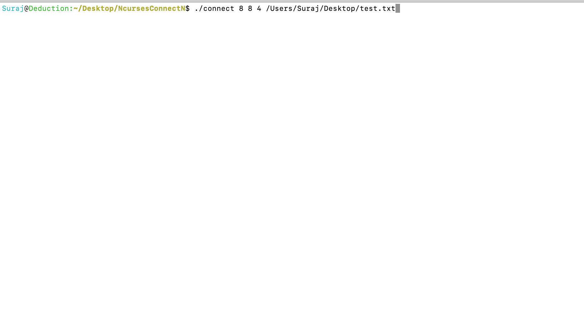
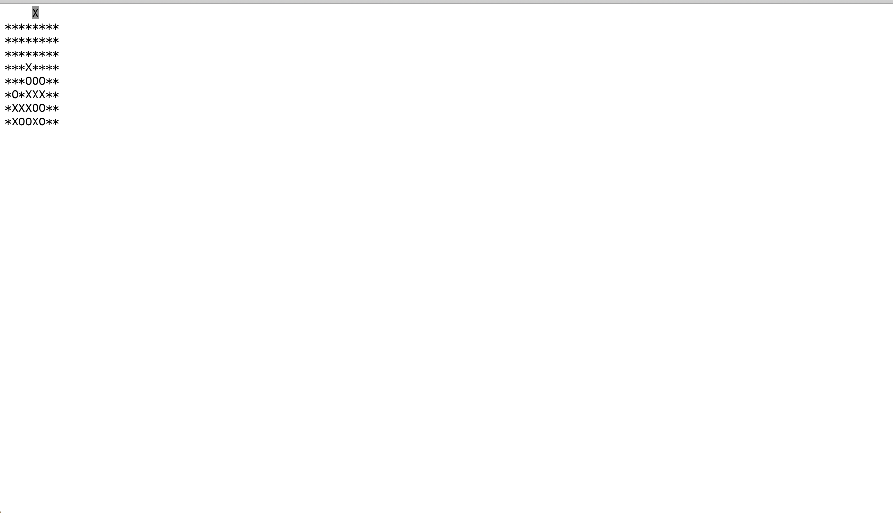
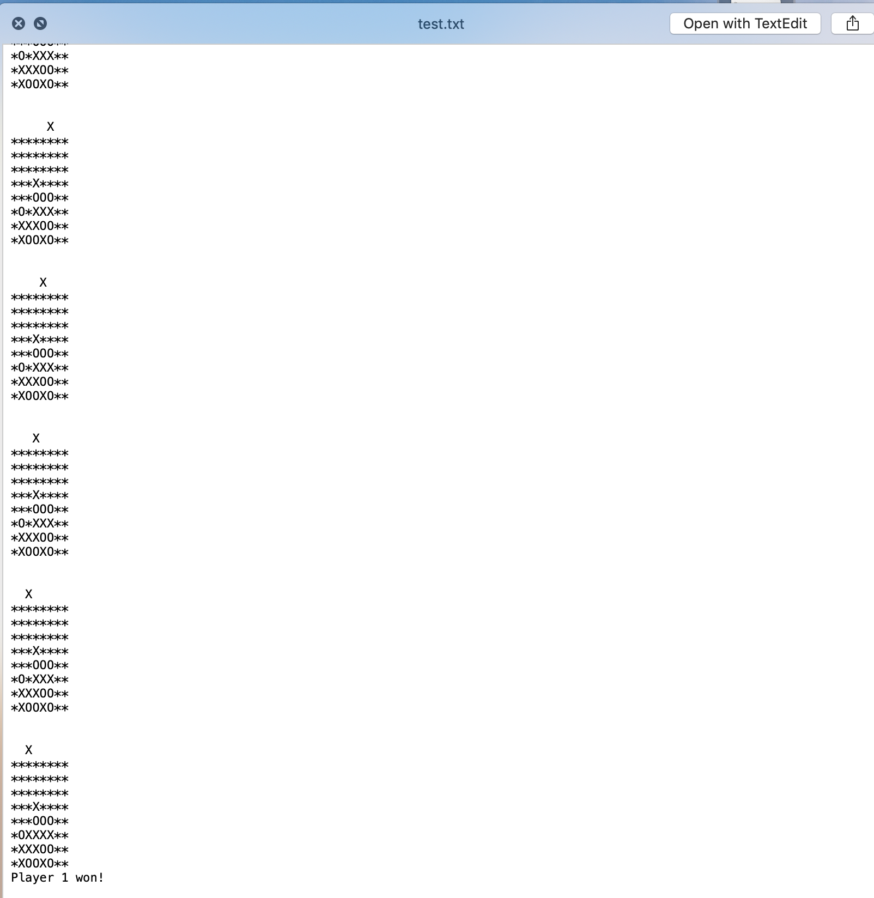

# Connect-N

This is a game based on connect 4 where the objective of the game is to be the first of two players to form a horizontal, vertical, or diagonal line of four of one's own discs. Connect-N let's the user choose the number of rows, columns, and the number of pieces needed to win. I used the Ncurses library so we can use the terminal as a GUI for controlling the game. 

## Getting Started

Prerequesities: terminal that can run programs compiled by gcc

All you need to do is clone the repository and compile the program using the provided makefile. Type "make" on your terminal and you should see a file named connect in your working directory. There is also a compiled connect file provided in the repo. 

After compiling, execute the program by typing in "./connect" followed by your choice of number of rows, columns, num pieces to win, and a file path for storing the log file. 

e.g. ./connect 10 10 3 /Users/Name/Desktop

### Controls

Move left : A or J

Move right : S or K

Place marker : Spacebar or Enter

### Preview 

Execution of program:

Playing the game:

Checking log file for the match history:

